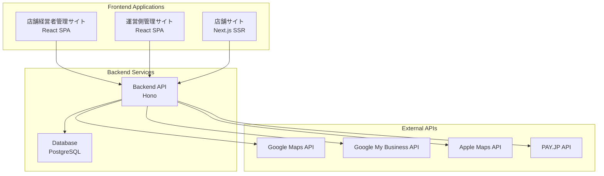

# ケアパッケージ - 個人店向け集客支援Webアプリ

## プロジェクト概要
最寄り駅から離れた位置に店舗を構えている集客に困っている個人店の経営者向けの、スマホで完結する集客支援ツール

## 主要機能

### 店舗経営者向け管理サイト
- **MEO対策機能**: GoogleMapやAppleMapなどのMEO機能
- **店舗情報管理**: 基本情報、営業時間、メニュー等の更新
- **Googleマイビジネス連携**: Googleマイビジネスの情報を更新できる機能
- **口コミ管理**: 口コミの管理機能
- **お知らせ投稿**: 店舗サイトへのお知らせ配信
- **プラン・課金管理**: サブスクリプション契約状況確認

### 運営側管理サイト
- **ユーザー管理**: 店舗経営者アカウント管理
- **店舗管理**: 全店舗の情報管理
- **システム設定**: 各種設定管理
- **分析・レポート**: 利用状況分析
- **課金管理**: 料金プラン設定、売上管理
- **決済管理**: 支払い状況、未払い管理

### 店舗サイト (顧客向け)
- **店舗情報表示**: 基本情報、営業時間、アクセス
- **お知らせ表示**: 最新情報の配信
- **SEO対応**: 検索エンジン最適化
- **SNSシェア対応**: OGP設定

## 技術スタック

### フロントエンド（3つのアプリケーション）
1. **店舗経営者向け管理サイト**: React SPA (TypeScript)
2. **運営側管理サイト**: React SPA (TypeScript)
3. **店舗サイト**: Next.js (TypeScript) - SEO重視
- レスポンシブデザイン（スマホ最適化）

### バックエンド
- **Node.js** (TypeScript)
- **Hono** (軽量・高速なWeb framework)
- RESTful API設計（フロントエンドと疎結合）

### データベース
- **PostgreSQL** (リレーショナルDB、スケーラブル)
- または **MongoDB** (NoSQL、柔軟なスキーマ)

### 認証
- **Google OAuth 2.0** (パスワード不要、スマホユーザー向け)

### 決済システム
- **PAY.JP** (日本特化、個人事業主向け)
- クレジットカード決済対応
- サブスクリプション課金機能

### 外部API連携
- Google Maps API
- Google My Business API
- Apple Maps API（将来的に）
- PAY.JP API（決済処理）

## 開発環境
- **Turborepo** モノリポジトリ管理
- **Docker** コンテナ化
- **Git** バージョン管理
- **ESLint/Prettier** コード品質管理

## 推奨アーキテクチャ


## 開発フェーズ
1. **Phase 1**: 共通バックエンド構築・基本認証
2. **Phase 2**: 店舗経営者向け管理サイト（基本機能）
3. **Phase 3**: 運営側管理サイト（ユーザー管理）
4. **Phase 4**: 決済機能（PAY.JP連携）
5. **Phase 5**: 店舗サイト（Next.js、SEO対応）
6. **Phase 6**: Google Maps API連携・MEO機能
7. **Phase 7**: Googleマイビジネス連携
8. **Phase 8**: 口コミ管理機能

## 運用方針
- スモールスタートでMVP開発
- 段階的な機能追加
- スマホファーストなUX/UI設計
- 個人店経営者の使いやすさを重視
- 日本国内向けサービス
- サブスクリプション課金モデル
- モノリポジトリで統一管理

## プロジェクト構成
```
care-package/
├── packages/
│   ├── shared/          # 共通ライブラリ・型定義
│   ├── api/             # Honoバックエンド
│   ├── store-admin/     # 店舗経営者向け管理サイト
│   ├── admin/           # 運営側管理サイト
│   └── store-site/      # 店舗サイト（Next.js）
├── docker-compose.yml
├── package.json
├── turbo.json
└── README.md
```

## 推奨パッケージ
### フロントエンド共通
- React Router (SPA routing - 管理サイト用)
- Axios (API通信)
- Material-UI または Tailwind CSS (UI components)
- React Hook Form (フォーム管理)

### Next.js (店舗サイト用)
- Next.js App Router
- next-seo (SEO最適化)
- SWR または TanStack Query (データフェッチ)

### バックエンド
- Hono (Web framework)
- Hono OAuth middleware (OAuth認証)
- Zod (バリデーション・Honoとの相性良い)
- dotenv (環境変数管理)
- @hono/cors (CORS設定)
- payjp (PAY.JP決済API)

### 開発ツール
- Turborepo (モノリポジトリ管理)
- Vite (フロントエンドビルド)
- Nodemon (バックエンド開発)
- Jest (テスト)
- Docker Compose (開発環境)
- Prisma または Drizzle ORM (データベース管理)

## 開発の進め方

### 作業フロー
1. **GitHub Issue作成**: 作業計画を記載してレビューを受ける
2. **作業ブランチ作成**: `feature/issue-番号-作業内容` 形式
3. **開発作業**: 適宜コミットを行う
4. **Pull Request作成**: 作業概要を記載してレビューを受ける
5. **レビュー完了後**: mainブランチにマージ