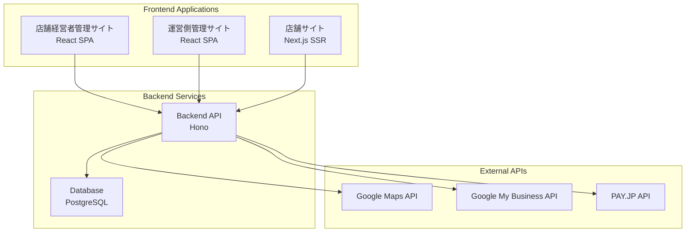

# ケアパッケージ - 個人店向け集客支援Webアプリ

> **最寄り駅から離れた位置に店舗を構えている集客に困っている個人店の経営者向けの、スマホで完結する集客支援ツール**

[](https://www.typescriptlang.org/)
[](https://reactjs.org/)
[](https://nodejs.org/)
[](https://www.postgresql.org/)

## 🎯 プロジェクト概要

ケアパッケージは、集客に困っている個人店経営者向けのスマートフォン完結型集客支援Webアプリケーションです。
MEO対策、店舗情報管理、口コミ管理などの機能を通じて、最寄り駅から離れた立地の店舗でも効果的な集客を支援します。

### 主要な特徴

- 📱 **スマホファースト設計** - モバイル最適化されたUI/UX
- 🏪 **3つのアプリケーション** - 店舗経営者、運営者、顧客向け
- 🔒 **Google OAuth認証** - パスワード不要の簡単ログイン
- 💳 **サブスクリプション課金** - PAY.JP連携による安全な決済
- 🗺️ **MEO対策** - Google Maps/Apple Maps対応

## 🏗️ アーキテクチャ



## 📁 プロジェクト構成

```
care-package/
├── packages/
│   ├── shared/          # 共通ライブラリ・型定義
│   ├── api/             # Honoバックエンド
│   ├── admin/           # ✅ 運営側管理サイト（React SPA）
│   ├── store-admin/     # ❌ 店舗経営者向け管理サイト（未実装）
│   └── store-site/      # ❌ 店舗サイト（Next.js、未実装）
├── docs/                # プロジェクトドキュメント
├── docker-compose.yml   # 開発環境設定
└── turbo.json          # モノリポ設定
```

## 🚀 クイックスタート

### 前提条件

- Node.js 18.x以上
- pnpm 8.x以上
- Docker & Docker Compose
- PostgreSQL 15.x以上

### セットアップ

```bash
# リポジトリのクローン
git clone <repository-url>
cd care-package

# 依存関係のインストール
pnpm install

# 開発環境の起動（Docker）
docker-compose up -d

# データベースマイグレーション
cd packages/api
pnpm db:migrate

# 開発サーバー起動
pnpm dev
```

### 各アプリケーションへのアクセス

- **運営管理サイト**: http://localhost:3000
- **API サーバー**: http://localhost:8000
- **データベース**: localhost:5432

## 📊 開発進捗

| フェーズ | 内容 | 状況 |
|---------|------|------|
| **Phase 1** | 共通バックエンド構築・基本認証 | ✅ 完了 |
| **Phase 2** | 運営側管理サイト | ✅ 完了 |
| **Phase 3** | 店舗経営者管理サイト基盤 | 🔄 進行中 |
| **Phase 4** | 店舗サイト自動生成 | ❌ 未実装 |
| **Phase 5** | 決済・課金システム | ❌ 未実装 |
| **Phase 6** | 高度な機能（MEO・口コミ管理） | ❌ 未実装 |

## 🛠️ 技術スタック

### フロントエンド
- **React 18** + **TypeScript** - SPA構築
- **Next.js 14** - SEO重視の店舗サイト
- **Vite** - 高速ビルドツール
- **React Router** - SPA ルーティング

### バックエンド
- **Node.js** + **TypeScript** - サーバーサイド
- **Hono** - 軽量・高速Webフレームワーク
- **PostgreSQL** - メインデータベース
- **Drizzle ORM** - 型安全なORM

### 開発・運用
- **Turborepo** - モノリポジトリ管理
- **pnpm** - パッケージマネージャー
- **Biome** - コード品質管理
- **Docker** - 開発環境構築

## 📖 ドキュメント

### 📋 プロジェクト概要
- [プロジェクト概要](./docs/プロジェクト概要.md) - プロジェクトの目的・機能・ユーザー
- [技術スタック](./docs/技術スタック.md) - 使用技術とアーキテクチャ詳細
- [開発フェーズ](./docs/開発フェーズ.md) - 開発計画と進捗状況

### 🔧 開発ガイド
- [CONTRIBUTING.md](./CONTRIBUTING.md) - 開発参加ガイドライン
- [データベース設計](./docs/データベース設計.md) - DB設計・モデル定義
- [USER_FLOWS.md](./docs/USER_FLOWS.md) - ユーザーフロー設計

### 📝 作業管理
- [作業ログ](./docs/backlog/) - 日次作業計画・進捗記録

## ⚡ 開発コマンド

```bash
# 全体
pnpm dev           # 全パッケージの開発サーバー起動
pnpm build         # 全パッケージのビルド
pnpm lint          # 全パッケージのlintチェック
pnpm check         # 全パッケージのlint + formatチェック
pnpm format        # 全パッケージのフォーマット実行

# 個別パッケージ
pnpm --filter=@care-package/admin dev    # 運営管理サイトのみ
pnpm --filter=@care-package/api dev      # APIサーバーのみ

# データベース
cd packages/api
pnpm db:generate   # マイグレーションファイル生成
pnpm db:migrate    # マイグレーション実行
pnpm db:studio     # Drizzle Studio起動
```

## 🤝 開発参加

プロジェクトへの参加方法については [CONTRIBUTING.md](./CONTRIBUTING.md) をご確認ください。

### 開発フロー

1. 🔍 **仕様策定** - `/docs`にドキュメント化
2. 📋 **作業計画** - `/docs/backlog`に計画書作成
3. 🌿 **ブランチ作成** - `feature/YYYY-MM-DD_作業内容`
4. 💻 **開発実行** - 工程ごとにコミット
5. 🔄 **Pull Request** - レビュー後マージ

## 📄 ライセンス

このプロジェクトは個人開発プロジェクトです。

---

**🎯 現在のフォーカス**: Phase 3 - 店舗経営者管理サイト基盤（Google OAuth認証・基本管理機能）の実装中