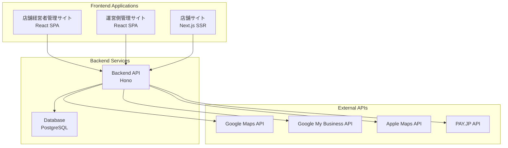

---
tags:
  - 技術スタック
  - アーキテクチャ
  - Node.js
  - TypeScript
  - React
type: 技術仕様
status: 更新中
created: 2025-01-23
updated: 2025-01-23
---

# ケアパッケージ - 技術スタック

> [!info] 基本方針
> スモールスタートを目指しているため、**Node.js x TypeScript** での実装を行う。
> ソース管理には**pnpm**と**Turborepo**モノリポジトリ構成を採用。

## 🏗 アーキテクチャ概要


## 💻 フロントエンド（3つのアプリケーション）

### 🏪 1. 店舗経営者向け管理サイト
> [!example] パス: `packages/store-admin`
> - **フレームワーク**: [[React]] SPA (TypeScript)
> - **ビルドツール**: [[Vite]]
> - **ルーティング**: React Router
> - **認証**: [[Google OAuth 2.0]] (パスワード不要、スマホユーザー向け)
> - **UI**: レスポンシブデザイン（スマホ最適化）

### 👨‍💼 2. 運営側管理サイト
> [!example] パス: `packages/admin`
> - **フレームワーク**: [[React]] SPA (TypeScript)
> - **ビルドツール**: [[Vite]]
> - **ルーティング**: React Router
> - **認証**: ID/PW認証
> - **対象**: 運営管理者向け

### 🌐 3. 店舗サイト（顧客向け）
> [!example] パス: `packages/store-site`
> - **フレームワーク**: [[Next.js]] (TypeScript) - SEO重視
> - **レンダリング**: SSR/ISR
> - **機能**: 閲覧専用（認証不要）
> - **最適化**: SEO対応、OGP設定

## 🔧 バックエンド

### 🚀 API サーバー
> [!example] パス: `packages/api`
> - **フレームワーク**: [[Hono]] (軽量・高速なWeb framework)
> - **設計**: RESTful API設計（フロントエンドと疎結合）
> - **言語**: Node.js (TypeScript)

### 🗄️ データベース
- **RDBMS**: [[PostgreSQL]] (リレーショナルDB、スケーラブル)
- **ORM**: [[Drizzle ORM]]
- **マイグレーション**: Drizzle Kit

## 📦 共通ライブラリ
> [!example] パス: `packages/shared`
> - **型定義の共有**
> - **ユーティリティ関数**
> - **バリデーションスキーマ**

## 🔗 外部サービス連携

### 🔐 認証
- **[[Google OAuth 2.0]]**: 店舗経営者向け認証

### 💳 決済システム
- **[[PAY.JP]]**: 日本特化、個人事業主向け決済サービス
- **クレジットカード決済対応**
- **サブスクリプション課金機能**

### 🌐 外部API
- **[[Google Maps API]]**: 地図表示・MEO対策
- **[[Google My Business API]]**: Googleマイビジネス連携
- **[[Apple Maps API]]**: 将来的な実装予定
- **[[PAY.JP API]]**: 決済処理

## 📋 推奨パッケージ

### 💻 フロントエンド共通
- **[[React Router]]**: SPA routing (管理サイト用)
- **[[Axios]]**: API通信
- **[[Material-UI]] または [[Tailwind CSS]]**: UI components
- **[[React Hook Form]]**: フォーム管理

### 🌐 Next.js (店舗サイト用)
- **[[Next.js App Router]]**: 最新のルーティングシステム
- **[[next-seo]]**: SEO最適化
- **[[SWR]] または [[TanStack Query]]**: データフェッチ

### 🔧 バックエンド
- **[[Hono]]**: Web framework
- **[[Hono OAuth middleware]]**: OAuth認証
- **[[Zod]]**: バリデーション（Honoとの相性良い）
- **[[dotenv]]**: 環境変数管理
- **[[@hono/cors]]**: CORS設定
- **[[payjp]]**: PAY.JP決済API

## 🛠 開発環境・ツール

### 📁 モノリポジトリ管理
- **[[Turborepo]]**: モノリポジトリ管理
- **[[pnpm]]**: パッケージマネージャー

### ⚒️ 開発ツール
- **[[Vite]]**: フロントエンドビルド
- **[[Nodemon]]**: バックエンド開発
- **[[Jest]]**: テスト
- **[[Docker Compose]]**: 開発環境
- **[[Biome]]**: コード品質管理（lint、format）

### ✅ コード品質管理
- **[[TypeScript]]**: 静的型付け
- **[[Biome]]**: Linting、Formatting
- **[[ESLint]]/[[Prettier]]**: コード品質管理（必要に応じて）

## 📁 プロジェクト構成

> [!abstract] モノリポジトリ構成
> ```
> care-package/
> ├── packages/
> │   ├── shared/          # 共通ライブラリ・型定義
> │   ├── api/             # Honoバックエンド
> │   ├── store-admin/     # 店舗経営者向け管理サイト
> │   ├── admin/           # 運営側管理サイト
> │   └── store-site/      # 店舗サイト（Next.js）
> ├── docs/                # ドキュメント
> ├── docker-compose.yml   # 開発環境
> ├── package.json         # ルートパッケージ設定
> ├── turbo.json          # Turboリポ設定
> └── pnpm-workspace.yaml # ワークスペース設定
> ```

## 🔗 関連ドキュメント
- [[プロジェクト概要]] - プロジェクトの全体像
- [[開発フェーズ]] - 開発計画と進捗状況
- [[データベース設計]] - DB設計の詳細
- [[USER_FLOWS]] - ユーザーフローの詳細