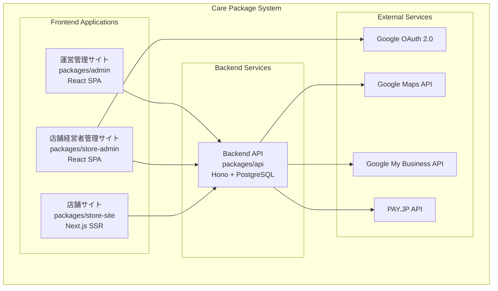
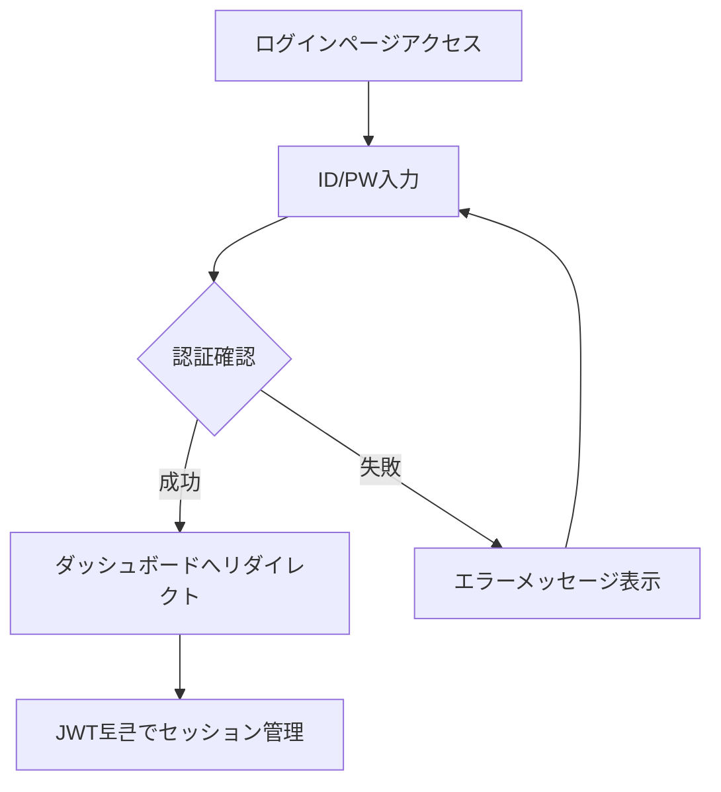
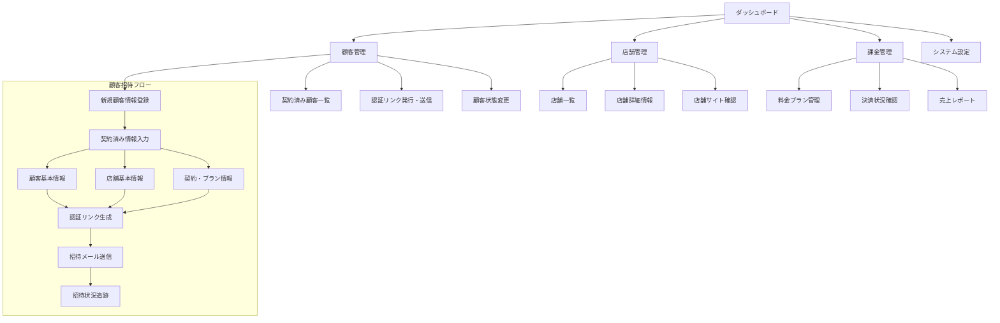
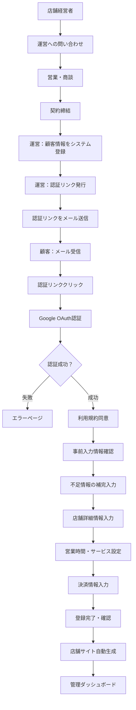
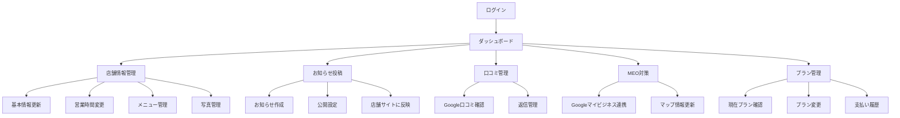
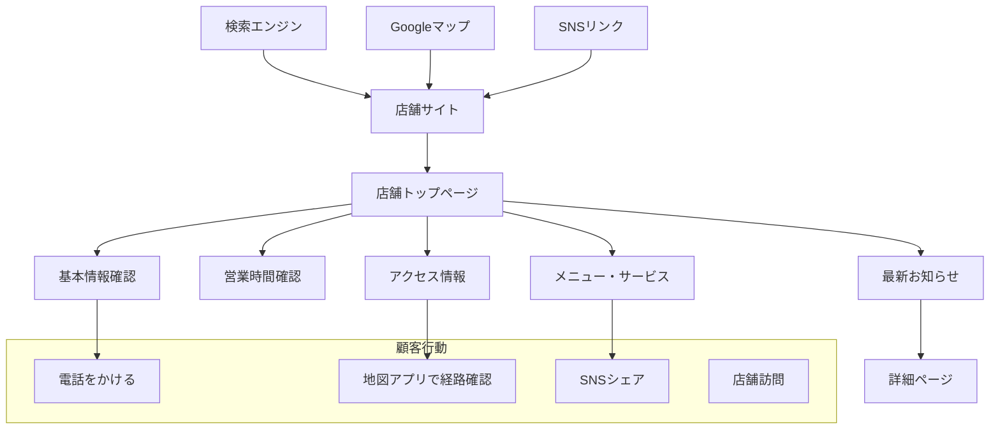
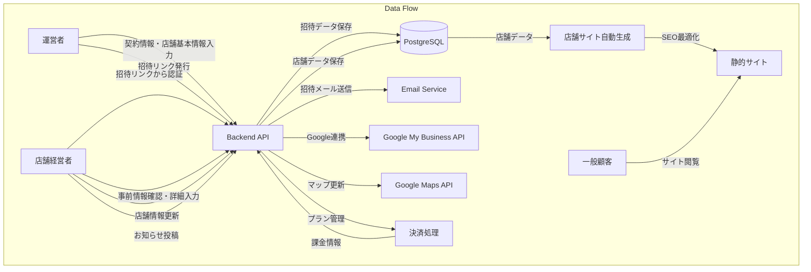
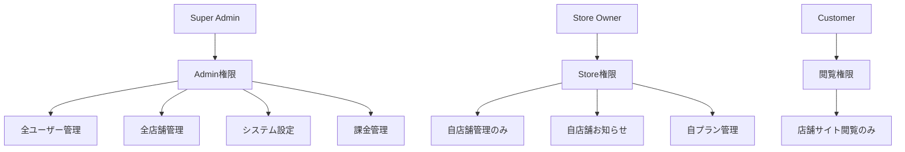

# ユーザーフロー設計書

## 概要
Care Packageアプリケーションの3つのユーザータイプのフローと画面遷移を定義します。

## ユーザータイプ
1. **運営者（管理者）**: システム全体の管理
2. **店舗経営者**: 自店舗の管理・運営
3. **一般顧客**: 店舗情報の閲覧

---

## 1. 全体システム構成図

---

## 2. 運営者フロー

### 2.1 認証フロー

### 2.2 主要業務フロー

---

## 3. 店舗経営者フロー

### 3.1 初回登録フロー（運営承認制）

### 3.2 日常運用フロー

---

## 4. 一般顧客フロー

### 4.1 店舗発見・閲覧フロー

---

## 5. データフロー図

---

## 6. 認証・認可設計

### 6.1 認証方式
| ユーザータイプ | 認証方式 | 実装状況 |
|--------------|----------|----------|
| 運営者 | ID/PW + JWT | ✅ 実装済み |
| 店舗経営者 | Google OAuth + JWT | ❌ 未実装 |
| 一般顧客 | 認証不要 | - |

### 6.2 権限設計

---

## 7. 今後の開発優先順位

### Phase 3: 店舗経営者管理サイト基盤
1. **Google OAuth認証実装**
2. **店舗経営者管理サイト構築** (`packages/store-admin`)
3. **店舗情報管理機能**
4. **基本的なダッシュボード**

### Phase 4: 店舗サイト自動生成
1. **店舗サイト構築** (`packages/store-site`)
2. **Next.js SSR実装**
3. **SEO最適化**
4. **店舗データとの連携**

### Phase 5: 決済・課金システム
1. **PAY.JP連携**
2. **プラン管理**
3. **決済フロー**
4. **課金管理機能**

### Phase 6: 高度な機能
1. **Google Maps API連携**
2. **Google My Business連携**
3. **口コミ管理**
4. **MEO対策機能**

---

## 8. 画面一覧

### 8.1 運営管理サイト (admin)
- [x] ログインページ
- [x] ダッシュボード
- [x] ユーザー管理（モック）
- [x] 店舗管理（モック）
- [ ] **顧客管理・招待機能**
  - [ ] 契約済み顧客一覧
  - [ ] 新規顧客招待登録
    - [ ] 顧客基本情報入力（名前、メール、電話）
    - [ ] 店舗基本情報入力（店名、住所、電話、カテゴリ）
    - [ ] 契約情報入力（プラン、開始日、料金）
    - [ ] 招待リンク生成・送信
  - [ ] 招待状況追跡・管理
- [ ] 課金管理
- [ ] システム設定
- [ ] レポート・分析

### 8.2 店舗経営者管理サイト (store-admin) - 未作成
- [ ] **招待専用認証フロー**
  - [ ] 招待リンク検証ページ
  - [ ] Google OAuth認証
  - [ ] 利用規約同意ページ
  - [ ] 事前入力情報確認画面
  - [ ] 不足情報補完入力画面
  - [ ] 店舗詳細情報入力画面（営業時間、サービス詳細等）
- [ ] ダッシュボード
- [ ] 店舗情報管理
- [ ] お知らせ投稿
- [ ] 口コミ管理
- [ ] MEO設定
- [ ] プラン管理

### 8.3 店舗サイト (store-site) - 未作成
- [ ] 店舗トップページ
- [ ] 店舗詳細情報
- [ ] お知らせ一覧
- [ ] アクセス・地図
- [ ] メニュー・サービス
- [ ] お問い合わせ

---

このユーザーフロー設計に基づいて、今後の開発を進めていきます。