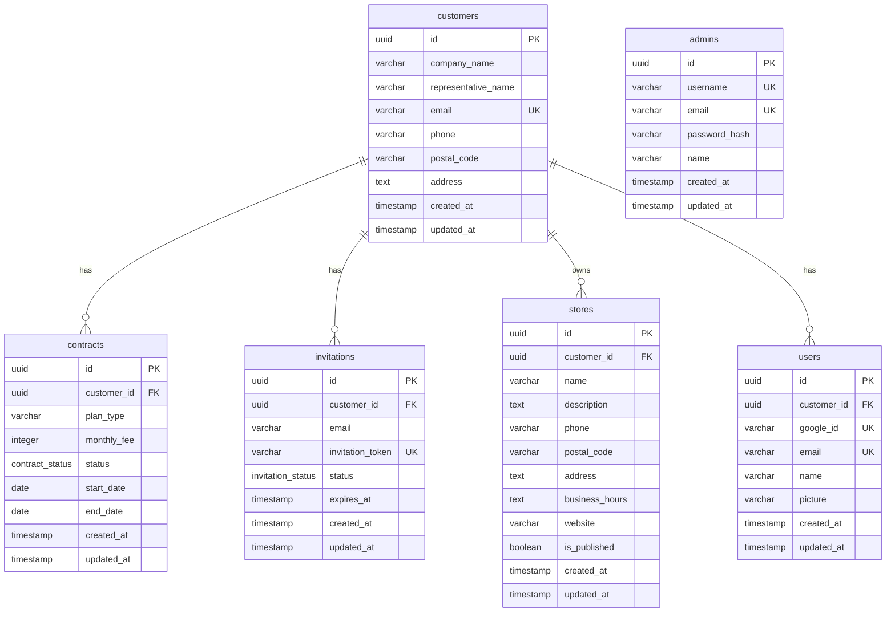

---
tags:
  - データベース
  - DB設計
  - PostgreSQL
  - Drizzle
  - スキーマ
type: 技術仕様
status: 更新中
created: 2025-01-23
updated: 2025-01-23
---

# ケアパッケージ - データベース設計

## 🎯 設計方針

### 🔄 正規化とマスタデータ管理
> [!info] 基本原則
> - **関心の分離**: 顧客、契約、店舗、招待、ユーザーを独立したテーブルで管理
> - **マスタデータ管理**: 顧客情報は永続化、契約は状態管理
> - **招待プロセス**: 一時的な招待管理と永続的なユーザー管理の分離

### 🏷️ ENUM型の活用
> [!example] ステータス管理の統一化
> - **ステータス管理**: status系フィールドはENUM型で定義
> - **命名規則**: `テーブル名Status`（例：`contractStatus`, `invitationStatus`）
> - **コメント必須**: 各ENUM値には日本語でコメントを付与

### 🔗 外部キー制約
> [!tip] 型安全な関連付け
> - **直接参照**: テーブル定義内で`.references()`を使用して直接参照
> - **型安全性**: [[Drizzle ORM]] の型推論を活用
> - **循環参照回避**: 複雑な後付け外部キー定義は避ける

## 📊 実装済みモデル（Phase 3対応）

### 👥 顧客管理（customers）
> [!abstract] 契約者のマスタデータを管理
> - **基本情報**: 会社名、代表者名、連絡先
> - **住所情報**: 郵便番号、住所
> - **ユニーク制約**: メールアドレス

### 📄 契約管理（contracts）
> [!abstract] 顧客の契約状況を管理
> - **契約情報**: プランタイプ、月額料金、契約期間
> - **ステータス**: アクティブ、一時停止、解約
> - **外部キー**: 顧客ID参照

### 📨 招待管理（invitations）
> [!abstract] 店舗経営者の招待プロセスを管理
> - **招待情報**: 招待先メール、招待トークン、有効期限
> - **ステータス**: 招待送信済み、承認済み、期限切れ
> - **外部キー**: 顧客ID参照

### 🏪 店舗情報（stores）
> [!abstract] 店舗の基本情報を管理
> - **店舗情報**: 店舗名、説明、営業時間
> - **連絡先**: 電話番号、住所、ウェブサイト
> - **公開設定**: 店舗サイトの公開状態
> - **外部キー**: 顧客ID参照

### 👤 ユーザー管理（users）
> [!abstract] [[Google OAuth]] 認証ユーザー（店舗経営者）を管理
> - **認証情報**: Google ID、メールアドレス
> - **ユーザー情報**: 名前、プロフィール画像
> - **外部キー**: 顧客ID参照

### 👨‍💼 運営管理者（admins）
> [!abstract] 運営側管理者（ID/PWログイン）を管理
> - **認証情報**: ユーザー名、パスワードハッシュ
> - **基本情報**: 名前、メールアドレス

## 🗺️ データ関係図

## 🔄 招待フロー設計

### 📤 1. 運営側から招待送信
> [!example] 招待プロセス
> 1. 運営管理者が顧客情報と招待先メールアドレスを入力
> 2. `customers`テーブルに顧客情報を登録
> 3. `contracts`テーブルに契約情報を登録
> 4. `invitations`テーブルに招待情報を登録（トークン生成）
> 5. 招待メール送信（招待トークン付きURL）

### ✅ 2. 店舗経営者の登録完了
> [!example] 登録完了プロセス
> 1. 招待URLから[[Google OAuth]] 認証画面へ
> 2. Google OAuth認証成功
> 3. 招待トークンと照合
> 4. `users`テーブルにユーザー情報を登録
> 5. `invitations`テーブルのstatusを`accepted`に更新

## 🚀 将来の拡張予定

### 🌐 Phase 4以降で追加予定
> [!warning] 店舗サイト関連
> - **店舗サイトコンテンツ管理**
> - **お知らせ・ニュース管理**
> - **メニュー・商品情報管理**

### 💳 Phase 5以降で追加予定
> [!warning] 決済・課金関連
> - **決済履歴管理**
> - **請求書管理**
> - **プラン変更履歴**

### 📊 Phase 6以降で追加予定
> [!warning] 高度な機能
> - **MEO対策データ**
> - **口コミ・レビュー管理**
> - **分析・レポートデータ**

## 📁 スキーマファイル構成

### 🔄 ファイル分割方針
> [!tip] 構成管理の原則
> - **テーブル単位での分割**: 各テーブルを独立したファイルに分離
> - **依存関係の考慮**: import/exportの順序はデータベースの依存関係を重視
> - **統合ファイル**: index.tsで依存関係順序を考慮した統合エクスポート

### ⚙️ 実装方針
> [!note] 技術的な指針
> - **直接参照**: 外部キー参照は定義内で直接実装
> - **循環参照回避**: 複雑な後付け外部キー定義は避ける
> - **型安全性**: [[Drizzle ORM]] の型推論を最大活用

## 🔗 関連ドキュメント
- [[プロジェクト概要]] - プロジェクトの全体像
- [[技術スタック]] - 使用技術の詳細
- [[開発フェーズ]] - 開発計画と進捗状況
- [[USER_FLOWS]] - ユーザーフローの詳細