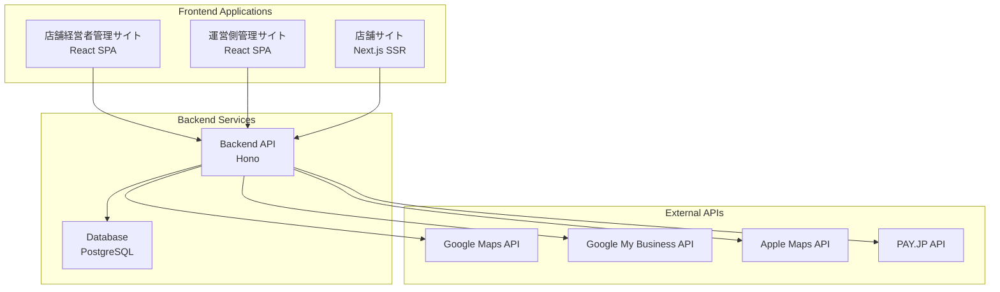
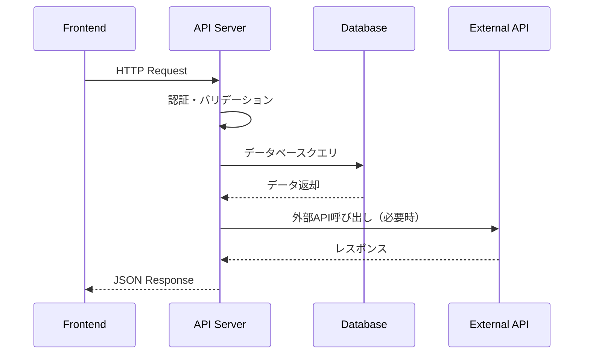
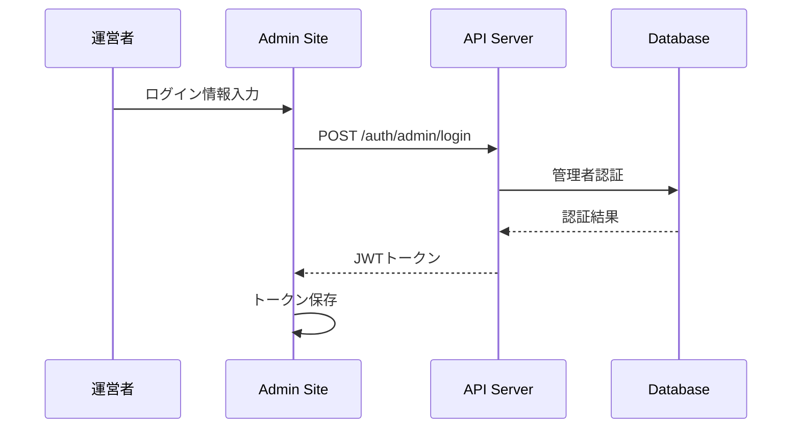
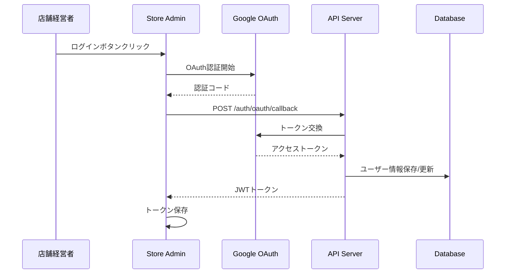

---
tags:
  - アーキテクチャ
  - システム構成
  - モノリポ
type: 技術仕様
status: 作成中
created: 2025-01-23
updated: 2025-01-23
---

# システム全体構成

> [!info] システム概要
> ケアパッケージは、モノリポジトリ構成による3つのフロントエンドアプリケーションと共通バックエンドAPIから構成されるWebアプリケーションです。

## 🏗️ 全体アーキテクチャ



## 📦 パッケージ構成

### モノリポジトリ構造

```
care-package/
├── packages/
│   ├── shared/          # 共通ライブラリ・型定義
│   ├── api/             # Honoバックエンド
│   ├── admin/           # 運営側管理サイト
│   ├── store-admin/     # 店舗経営者向け管理サイト
│   └── store-site/      # 店舗サイト（Next.js）
├── docs/                # プロジェクトドキュメント
├── docker-compose.yml   # 開発環境設定
├── turbo.json          # Turborepo設定
└── pnpm-workspace.yaml # pnpmワークスペース設定
```

### 各パッケージの責務

#### `packages/shared`
- **目的**: 共通ライブラリ・型定義・ユーティリティ
- **内容**:
  - TypeScript型定義の共有
  - バリデーションスキーマ（Zod）
  - 共通ユーティリティ関数
  - 定数・ENUM定義

#### `packages/api`
- **目的**: バックエンドAPI・データベース管理
- **技術**: Node.js + TypeScript + Hono + Drizzle ORM
- **責務**:
  - RESTful API提供
  - データベース操作
  - 認証・認可処理
  - 外部API連携

#### `packages/admin` ✅ 実装済み
- **目的**: 運営側管理サイト
- **技術**: React SPA + TypeScript + Vite
- **責務**:
  - 運営者向け管理画面
  - ユーザー・店舗管理
  - システム設定・分析

#### `packages/store-admin` ❌ 未実装
- **目的**: 店舗経営者向け管理サイト
- **技術**: React SPA + TypeScript + Vite
- **責務**:
  - 店舗情報管理
  - MEO対策機能
  - 口コミ管理
  - Google OAuth認証

#### `packages/store-site` ❌ 未実装
- **目的**: 顧客向け店舗サイト
- **技術**: Next.js + TypeScript + SSR
- **責務**:
  - 店舗情報表示
  - SEO最適化
  - 動的サイト生成

## 🔗 データフロー

### API通信パターン



### 認証フロー

#### 運営者認証（ID/PW）


#### 店舗経営者認証（Google OAuth）


## 🛠️ 開発・デプロイ環境

### 開発環境
- **Docker Compose**: PostgreSQL、Redis等のローカル環境
- **Hot Reload**: 各フロントエンドアプリケーションの開発サーバー
- **API開発**: Nodemon による自動再起動

### ビルド・デプロイ
- **Turborepo**: 並列ビルド・キャッシュ最適化
- **個別デプロイ**: 各パッケージを独立してデプロイ可能
- **型安全性**: 共通型定義による型エラー検出

## 📊 パフォーマンス考慮

### フロントエンド最適化
- **コード分割**: React Lazy Loading
- **バンドル最適化**: Vite による高速ビルド
- **キャッシュ戦略**: SWR/TanStack Query

### バックエンド最適化
- **軽量フレームワーク**: Hono による高速レスポンス
- **データベース最適化**: インデックス設計
- **API設計**: RESTful設計による疎結合

## 🔒 セキュリティアーキテクチャ

### 認証・認可
- **JWT**: トークンベース認証
- **CORS**: 適切なオリジン制限
- **HTTPS**: 本番環境での暗号化通信

### データ保護
- **環境変数**: 機密情報の分離
- **バリデーション**: Zod による入力検証
- **SQL インジェクション対策**: ORM使用

## 🔗 関連ドキュメント

- [[tech_stack]] - 技術スタック詳細
- [[database]] - データベース設計
- [[../3_guides/getting_started]] - 開発環境構築手順