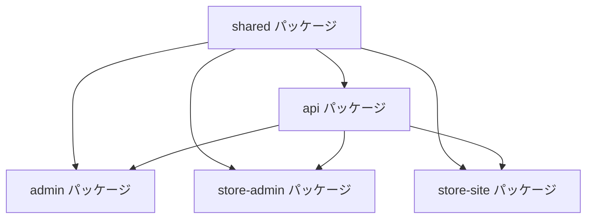

# @care-package/shared

> **ケアパッケージ共通ライブラリ**  
> TypeScript型定義・ユーティリティ・バリデーションスキーマの共有パッケージ

## 📋 概要

ケアパッケージプロジェクト内のすべてのパッケージ（API、フロントエンド）で共有する型定義、ユーティリティ関数、バリデーションスキーマを提供します。モノリポジトリ構成において型安全性と開発効率を向上させる重要な役割を担います。

### 主な機能

- 🔧 **型定義の共有**: API・フロントエンド間の型安全性確保
- ✅ **バリデーションスキーマ**: Zodによる入力検証ルール
- 🛠️ **ユーティリティ関数**: 共通処理の再利用
- 📊 **定数・ENUM**: システム全体で使用する定数定義
- 📅 **日付処理**: date-fnsベースの日付ユーティリティ

## 🛠️ 技術スタック

- **言語**: TypeScript 5.7+
- **バリデーション**: Zod（予定）
- **日付処理**: date-fns
- **ビルド**: TypeScript Compiler

## 📦 提供する機能

### 型定義 (`src/types/`)

```typescript
// ユーザー関連型
export interface User {
  id: string
  email: string
  name: string
  createdAt: Date
  updatedAt: Date
}

// 店舗関連型
export interface Store {
  id: string
  name: string
  description: string
  address: string
  phoneNumber: string
  status: StoreStatus
}

// システム共通型
export type ApiResponse<T> = {
  success: boolean
  data?: T
  error?: string
  message?: string
}
```

### ユーティリティ関数 (`src/utils/`)

```typescript
// 日付フォーマット
export function formatDate(date: Date, format?: string): string

// バリデーション
export function isValidEmail(email: string): boolean
export function isValidPhoneNumber(phone: string): boolean

// 文字列処理
export function sanitizeInput(input: string): string
export function generateSlug(text: string): string

// 数値処理
export function formatCurrency(amount: number): string
export function calculateTax(amount: number, rate: number): number
```

### 定数・ENUM定義

```typescript
// ユーザーステータス
export enum UserStatus {
  ACTIVE = 'active',
  INACTIVE = 'inactive',
  SUSPENDED = 'suspended'
}

// 店舗ステータス
export enum StoreStatus {
  PENDING = 'pending',
  APPROVED = 'approved',
  REJECTED = 'rejected',
  SUSPENDED = 'suspended'
}

// 契約ステータス
export enum ContractStatus {
  ACTIVE = 'active',
  PAUSED = 'paused',
  CANCELLED = 'cancelled'
}

// API エンドポイント
export const API_ENDPOINTS = {
  AUTH: '/auth',
  USERS: '/api/users',
  STORES: '/api/stores',
  CONTRACTS: '/api/contracts'
} as const
```

## 🚀 使用方法

### インストール・インポート

```typescript
// 他のパッケージのpackage.json
{
  "dependencies": {
    "@care-package/shared": "workspace:*"
  }
}

// TypeScriptファイルでのインポート
import { User, Store, ApiResponse } from '@care-package/shared/types'
import { formatDate, isValidEmail } from '@care-package/shared/utils'
import { UserStatus, API_ENDPOINTS } from '@care-package/shared'
```

### APIサーバーでの使用例

```typescript
// packages/api/src/routes/users.ts
import { User, ApiResponse } from '@care-package/shared/types'
import { isValidEmail } from '@care-package/shared/utils'

app.post('/api/users', async (c) => {
  const userData = await c.req.json()
  
  if (!isValidEmail(userData.email)) {
    return c.json<ApiResponse<null>>({
      success: false,
      error: 'Invalid email format'
    }, 400)
  }
  
  const user: User = await createUser(userData)
  
  return c.json<ApiResponse<User>>({
    success: true,
    data: user
  })
})
```

### フロントエンドでの使用例

```typescript
// packages/admin/src/pages/UsersPage.tsx
import { User, ApiResponse } from '@care-package/shared/types'
import { formatDate } from '@care-package/shared/utils'
import { UserStatus } from '@care-package/shared'

const UsersPage: React.FC = () => {
  const [users, setUsers] = useState<User[]>([])
  
  const fetchUsers = async () => {
    const response = await api.get<ApiResponse<User[]>>('/api/users')
    if (response.data.success) {
      setUsers(response.data.data || [])
    }
  }
  
  return (
    <div>
      {users.map(user => (
        <div key={user.id}>
          <h3>{user.name}</h3>
          <p>登録日: {formatDate(user.createdAt, 'yyyy/MM/dd')}</p>
          <span className={`status-${user.status}`}>
            {user.status === UserStatus.ACTIVE ? 'アクティブ' : '非アクティブ'}
          </span>
        </div>
      ))}
    </div>
  )
}
```

## 💻 開発コマンド

```bash
# 型チェック
pnpm type-check

# ビルド（他パッケージから参照するため）
pnpm build

# コード品質管理
pnpm lint          # Lintチェック
pnpm check         # Lint + Format チェック
pnpm format        # フォーマット実行
```

## 🔧 プロジェクト構成

```
src/
├── index.ts              # エクスポートエントリーポイント
├── types/                # 型定義
│   └── index.ts          # 全型定義のエクスポート
└── utils/                # ユーティリティ関数
    └── index.ts          # 全ユーティリティのエクスポート
```

### エクスポート構成

```typescript
// src/index.ts
export * from './types'
export * from './utils'

// 定数・ENUM
export const API_ENDPOINTS = { /* ... */ }
export enum UserStatus { /* ... */ }
export enum StoreStatus { /* ... */ }
```

## 📊 型安全性の確保

### 強型付けの恩恵

```typescript
// ❌ 型安全性のない場合
const user = await api.get('/api/users/1')
console.log(user.data.naem) // タイポエラーを検出できない

// ✅ 型安全性のある場合
const response = await api.get<ApiResponse<User>>('/api/users/1')
if (response.data.success) {
  console.log(response.data.data.name) // 型チェックでタイポを検出
}
```

### パッケージ間の型共有



## 🚨 トラブルシューティング

### 型エラーが解決しない

```bash
# shared パッケージの再ビルド
cd packages/shared
pnpm build

# 他のパッケージで型チェック実行
cd ../api
pnpm type-check
```

### インポートエラー

```bash
# パッケージの依存関係確認
cd packages/api
pnpm list @care-package/shared

# 再インストール
pnpm install
```

## 📈 今後の拡張予定

### Phase 3-4で追加予定

- **Zodバリデーションスキーマ**: API・フロントエンド間のバリデーション統一
- **Google OAuth型定義**: 認証フロー用の型
- **店舗サイト関連型**: Next.js用の静的生成型
- **決済関連型**: PAY.JP連携用の型定義

### Phase 5-6で追加予定

- **MEO関連型**: Google Maps API用の型
- **分析・レポート型**: ダッシュボード用の集計型
- **通知・メール型**: システム通知用の型

## 🔗 関連ドキュメント

- [プロジェクト概要](../../README.md)
- [開発貢献ガイド](../../CONTRIBUTING.md)
- [システム構成](../../docs/2_architecture/system_overview.md)
- [API設計ガイド](../../docs/3_guides/api_design.md)

## 🎯 ベストプラクティス

### 型定義作成時の注意点

1. **明確な命名**: 用途が分かりやすい型名を使用
2. **適切な粒度**: 大きすぎず小さすぎない型定義
3. **後方互換性**: 既存型の破壊的変更を避ける
4. **ドキュメント**: JSDocコメントで型の説明を追加

### ユーティリティ関数作成時の注意点

1. **純粋関数**: 副作用のない関数として実装
2. **エラーハンドリング**: 適切な例外処理
3. **単体テスト**: 各関数のテストケース作成
4. **型安全性**: 引数・戻り値の型を明確に定義

---

**モノリポジトリ全体の型安全性と開発効率を支える基盤パッケージ** 🔧