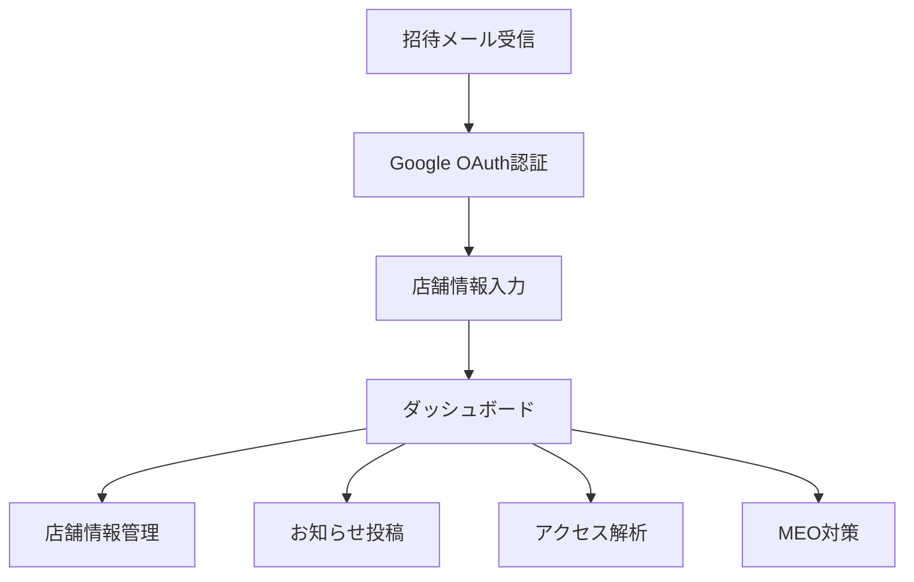
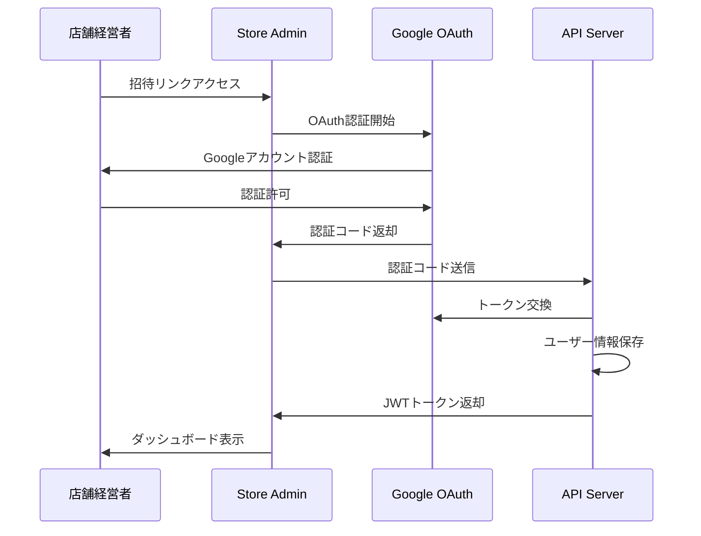

# @care-package/store-admin

> **ケアパッケージ店舗経営者向け管理サイト**  
> React SPA + TypeScript による店舗経営者向け管理ダッシュボード

## 📋 概要

個人店向け集客支援Webアプリ「ケアパッケージ」の店舗経営者向け管理サイトです。
店舗情報管理、MEO対策、口コミ管理、お知らせ投稿などの機能を通じて、個人店の集客支援を行うWebアプリケーションです。

### 主な機能（Phase 3-6で実装予定）

- 🏪 **店舗情報管理**: 基本情報、営業時間、メニュー等の更新
- 🗺️ **MEO対策機能**: GoogleMap・AppleMapでの最適化
- 🔗 **Googleマイビジネス連携**: 情報の自動同期・更新
- 💬 **口コミ管理**: レビュー確認・返信機能
- 📢 **お知らせ投稿**: 店舗サイトへのお知らせ配信
- 💳 **プラン・課金管理**: サブスクリプション契約状況確認
- 📊 **アクセス解析**: 店舗サイトの訪問者分析

## 🛠️ 技術スタック（予定）

- **フレームワーク**: React 19 + TypeScript
- **ビルドツール**: Vite
- **ルーティング**: React Router v7
- **状態管理**: React Context API + SWR/TanStack Query
- **UIライブラリ**: Tailwind CSS + Radix UI
- **認証**: Google OAuth 2.0 + JWT
- **HTTP クライアント**: Axios
- **地図機能**: Google Maps JavaScript API

## 🚀 開発ステータス

> ⚠️ **現在未実装**  
> Phase 3で基盤実装、Phase 4-6で段階的に機能追加予定

### Phase 3: 基盤構築（進行中）
- [ ] Google OAuth 2.0認証フロー
- [ ] 基本的な店舗情報管理画面
- [ ] 招待システム（運営側からの店舗登録）
- [ ] レスポンシブUI基盤（スマホファースト）

### Phase 4: 店舗サイト連携
- [ ] 店舗サイト自動生成との連携
- [ ] お知らせ投稿・管理機能
- [ ] 基本的なアクセス解析

### Phase 5: 決済・課金システム
- [ ] サブスクリプション契約状況表示
- [ ] 料金プラン変更機能
- [ ] 請求書・決済履歴確認

### Phase 6: 高度な機能
- [ ] MEO対策ダッシュボード
- [ ] Googleマイビジネス連携
- [ ] 口コミ管理・返信機能
- [ ] 詳細なアクセス解析・レポート

## 🎯 ユーザー体験設計

### ターゲットユーザー
- **個人店経営者**: 集客に困っている小規模事業者
- **デバイス**: スマートフォン中心（モバイルファースト）
- **ITリテラシー**: 中程度（直感的な操作が重要）

### 主要ユーザーフロー



### 認証フロー（Google OAuth）



## 📱 スマホファーストUI設計

### レスポンシブ対応方針
- **モバイル**: 375px-768px（メイン対象）
- **タブレット**: 768px-1024px
- **デスクトップ**: 1024px以上（サブ対応）

### UI/UX ガイドライン
- **タッチ操作**: 44px以上のタップターゲット
- **読みやすさ**: 16px以上のフォントサイズ
- **ナビゲーション**: ボトムナビゲーション採用
- **操作性**: スワイプ・プルリフレッシュ対応

## 🔐 セキュリティ設計

### 認証・認可
- **Google OAuth 2.0**: パスワード不要の安全認証
- **JWT**: ステートレス認証トークン
- **店舗隔離**: 各店舗は自店舗データのみアクセス可能

### データ保護
- **HTTPS**: 全通信の暗号化
- **CORS**: 適切なオリジン制限
- **XSS対策**: サニタイゼーション実装

## 🔗 外部API連携（Phase 6）

### Google Maps API
```typescript
// 店舗位置表示・MEO対策
interface MapConfig {
  apiKey: string
  center: { lat: number, lng: number }
  zoom: number
  markers: MapMarker[]
}
```

### Google My Business API
```typescript
// Googleマイビジネス情報同期
interface BusinessProfile {
  name: string
  description: string
  address: Address
  phoneNumber: string
  hours: BusinessHours[]
  photos: Photo[]
}
```

## 📊 予想される画面構成

### 🏠 ダッシュボード
- 店舗サイトアクセス数
- 最新の口コミ
- お知らせ投稿数
- 契約状況サマリー

### 🏪 店舗情報管理
- 基本情報編集
- 営業時間設定
- メニュー・サービス管理
- 写真アップロード

### 📢 お知らせ管理
- お知らせ作成・編集
- 公開スケジュール設定
- プレビュー機能
- 配信履歴

### 📊 分析・レポート
- アクセス数推移
- 流入元分析
- デバイス別統計
- 地域別分析

### ⚙️ 設定
- アカウント情報
- 通知設定
- プラン変更
- 支払い履歴

## 💻 開発予定コマンド

```bash
# 開発サーバー起動
pnpm dev

# 本番ビルド
pnpm build

# 型チェック
pnpm type-check

# テスト実行
pnpm test

# コード品質管理
pnpm lint
pnpm check
pnpm format
```

## 🔧 予想されるプロジェクト構成

```
src/
├── App.tsx
├── main.tsx
├── components/
│   ├── Layout/
│   │   ├── Layout.tsx
│   │   ├── Header.tsx
│   │   └── BottomNav.tsx
│   ├── Auth/
│   │   └── GoogleAuthButton.tsx
│   └── Store/
│       ├── StoreInfoForm.tsx
│       └── NoticeEditor.tsx
├── pages/
│   ├── DashboardPage.tsx
│   ├── StoreManagePage.tsx
│   ├── NoticesPage.tsx
│   ├── AnalyticsPage.tsx
│   └── SettingsPage.tsx
├── hooks/
│   ├── useAuth.ts
│   ├── useStore.ts
│   └── useNotices.ts
└── services/
    ├── auth.ts
    ├── store.ts
    └── analytics.ts
```

## 🚨 技術的課題・検討事項

### Google OAuth実装
- 招待システムとの連携方式
- トークン管理・リフレッシュ戦略
- エラーハンドリング（認証失敗時）

### スマホ最適化
- 画像アップロード・リサイズ処理
- オフライン対応の必要性
- プッシュ通知実装

### パフォーマンス
- 地図表示の最適化
- 画像遅延読み込み
- データキャッシュ戦略

## 🔗 関連ドキュメント

- [プロジェクト概要](../../README.md)
- [開発貢献ガイド](../../CONTRIBUTING.md)
- [システム構成](../../docs/2_architecture/system_overview.md)
- [ユーザーフロー](../../docs/1_introduction/user_flows.md)
- [APIサーバー](../api/README.md)

## 📅 開発スケジュール

| フェーズ | 期間 | 主要機能 |
|---------|------|----------|
| **Phase 3** | 2-3週間 | Google OAuth・基本管理画面 |
| **Phase 4** | 3-4週間 | お知らせ機能・店舗サイト連携 |
| **Phase 5** | 2-3週間 | 課金管理・決済履歴 |
| **Phase 6** | 4-6週間 | MEO対策・高度な分析機能 |

---

**スマホファーストで個人店経営者の集客を支援する、使いやすい管理ダッシュボード** 📱